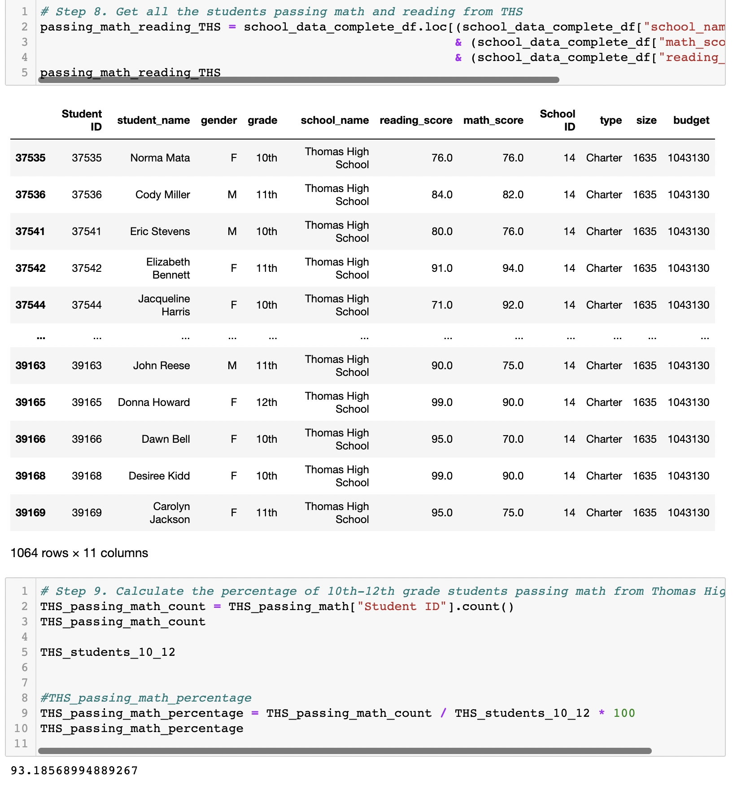
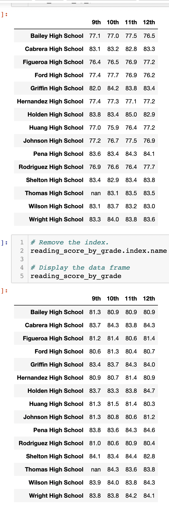
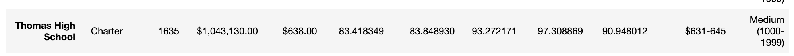
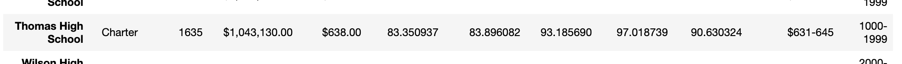

# School_District_Analysis

## Overview
The purpose of this analysis is to chart the school districts' student count, type of school, total budget and how the average per student, the average passing scores of math and reading, the passing percentages of math and reading, and the overall passing scores for the school. It is further broken down by grade, by size, by success rate based on per capita spending, as well as the top and bottom five performers.

## Results
* Due to potential academic dishonesty from the Thomas High School ninth-graders, we removed their reading and math scores, replacing with a NaN value. Taking out an entire grades' scores for two subjects negatively impacted the school's overall, so we repeated our initial school district analysis. 
* The school district's analysis had to be redone to account for the missing ninth-graders scores. In the school summary, this was done by creating conditionals to get the total amount of 10th, 11th, and 12th graders and their respective average scores and passing percentages in the math and reading categories.
* By removing the ninth_graders scores, the overall performance of Thomas High School improved drastically, going from approximately 60% in both areas to over 90%. 
* The first image are the results of the initial analysis before the ninth-graders are taken from the total. 
* The second is after the ninth-graders have been removed. 

## Summary
* The passing percentage for each category increased greatly, from approximately 60% to in the 90%.
* This change had little effect on the average scores for math and reading however, decreasing only slightly.
* The overall passing percentage for Thomas High School improved massively as well, going from in the 60% to the 90%.
* Despite keeping the same student count, the only contributors to Thomas High School's data are the 10th, 11th, and 12th graders.

